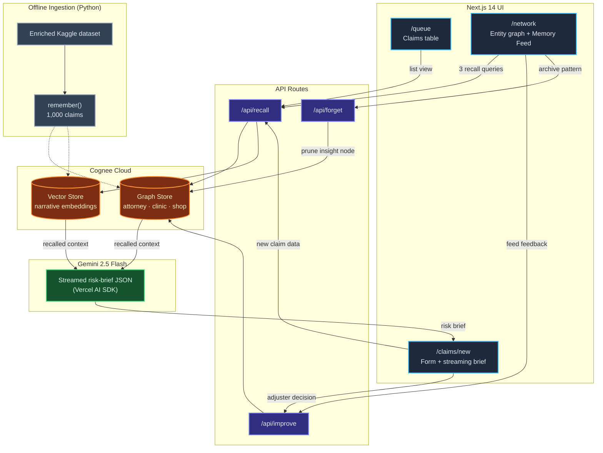

# ClaimTrace

> *Fraud rings don't hide. They just count on nobody looking at the full picture.*

[](https://wemakedevs.org)
[](https://opensource.org/licenses/Apache-2.0)
[](https://nextjs.org/)
[](https://cognee.ai)
[](https://deepmind.google/technologies/gemini/)

**[Live Demo →](https://claimetrace.vercel.app)**

---

## The Problem

SIU (Special Investigation Unit) fraud detection today runs on static rules engines - flag anything over $50,000, done. That catches lone wolves. It does **not** catch rings: the same attorney, the same clinic, the same suspiciously-familiar injury narrative, spread across a dozen claimants and eighteen months, where every individual claim looks completely clean in isolation.

That's not a detection-algorithm problem. It's a **memory** problem. Nobody's holding the full picture.

## The Proof

The fastest way to understand ClaimTrace is the **Stateless Mode** switch on the New Claim screen.

| | Memory OFF (legacy rules-engine simulation) | Memory ON (Cognee recall) |
|---|---|---|
| **Same claim, same attorney (Kaplan & Associates)** | Generic pass, **Medium Risk - score 45** | **Critical Risk - score 91**, with explicit entity alerts |
| **Why** | Evaluates the claim in a vacuum, zero history | Recalls 1,000 historical claims, surfaces 8 prior suspicious filings tied to the same attorney |
| **Time to answer** | Instant | **< 60 seconds**, live-streamed |

Flip the switch, submit the identical claim, and watch the score jump from 45 to 91 in front of you. That's not a UI trick - it's the same Gemini call with `cogneeRecall()` either wired in or bypassed. It's the whole thesis of the project made visible in one interaction.

---

## Architecture



**Ingestion (offline, `scripts/enrich_and_ingest.py`):** 1,000 raw Kaggle claims → Gemini generates realistic injury narratives + extracts attorney/clinic/shop/state entities → batched into Cognee (100 at a time) → 3 fraud rings (45 claims) emerge naturally from entity co-occurrence, not manual tagging.

**Live loop (online, `/api/recall`):** new claim → `cogneeRecall()` returns graph + vector neighbors → both new claim and recalled context go into one Gemini prompt → streamed structured output (`risk_score`, `risk_level`, `entity_alerts`, `pattern_matches`, `recommended_action`, `summary`).

**Learning loop (`/api/improve`):** every adjuster click (Approve / Flag / Escalate) writes the human decision back into the graph, re-weighting what gets recalled next time.

---

## What It Actually Does

### 1. The Entity Network Graph (`/network`)
A full-screen React Flow canvas. Three fraud rings are visible the moment the page loads - no filtering required:

| Ring | Attorney | Clinic | Shop | Geography |
|------|----------|--------|------|-----------|
| **A** | Kaplan & Associates | Summit Rehab Clinic | QuickFix Auto Body | SC, NC |
| **B** | Meridian Legal Group | FastTrack Medical Center | Precision Collision Center | NY, VA |
| **C** | Coastal Injury Law | Premier Wellness Center | Elite Auto Repair | OH, WV |

Nodes are glassmorphic cards (`bg-card/80 backdrop-blur-md`) with color-coded left borders (red = attorney, orange = clinic, yellow = shop; red/yellow fill = critical/flagged claim). Investigators drag, zoom, and isolate rings via the filter bar to visually confirm dense clusters of bad-actor activity.

### 2. Memory Accuracy Timeline
An animated Recharts line graph at the top of the Claims Queue, tracking adjuster agreement with the AI's risk calls over a 4-week window: **68% → 91%**, with a pulsing "Learning Active" indicator. This is the `improve()` API's compounding effect made visible - the system isn't a static model scoring in isolation, it's a feed that gets sharper every time a human acts on it.

### 3. The Memory Feed
Runs alongside the graph like a senior SIU investigator with 10 years on the job. Three parallel recall queries surface: ring acceleration, dormancy breaks, and emerging attorney-clinic pairings that don't match a known ring yet.

### 4. Streaming Risk Briefs (`/claims/new`)
Split layout - claim form on the left, risk brief streaming in live on the right as Gemini processes the recalled context. Exportable as PDF (`jspdf` + `html-to-image`) for the claim file. Adjuster decision buttons at the bottom call `improve()` directly.

---

## Cognee Integration

All four memory lifecycle APIs are load-bearing - removing any one breaks something specific.

* **`remember()`** - Called during ingestion for all 1,000 claims (batched, 100 at a time, to stay under rate limits), and again after every adjuster decision on a live claim. Each claim is structured entity-first so Cognee's extraction pipeline builds graph edges between claims sharing attorneys/clinics/shops; the injury narrative goes in verbatim for vector embedding.
* **`recall()`** - Two contexts: (1) new-claim scoring, where the query is the new claim's entities + narrative and the response feeds the Gemini risk brief; (2) the Memory Feed's three parallel background queries (ring velocity, emerging pairings, narrative signal).
* **`improve()`** - Fired on every adjuster decision (approve/flag/escalate) and every Memory Feed card interaction (confirmed/not relevant). This is the mechanism behind the 68%→91% accuracy climb.
* **`forget()`** - Two surfaces: per-claim GDPR deletion with a pre-prune audit log entry (compliance), and "archive pattern" on a Memory Feed card, which forgets the *derived insight node* specifically - not the underlying claims - so a closed investigation stops resurfacing without destroying the historical record.

---

## Tech Stack

- **Framework**: Next.js 14 (App Router), React 19, TypeScript
- **Styling**: Tailwind CSS v4 + shadcn/ui, Framer Motion
- **Graph UI**: React Flow (`@xyflow/react`)
- **LLM**: Gemini 2.5 Flash via Vercel AI SDK (`@ai-sdk/react`, `@ai-sdk/google`)
- **Memory / Persistence**: Cognee Cloud (`cognee-ts`) - the *only* persistence layer, no separate database
- **Export**: `jspdf`, `html-to-image`
- **Scripts**: Python (dataset enrichment + ingestion)
- **Deployment**: Vercel

---

## The UI

A custom "Starry-Night" dark theme (`#020617` background) built to feel like an investigator's console, not a spreadsheet:

- **Entity Nodes**: Glassmorphic cards instead of solid boxes, color-coded left-border accents by entity type - readable at a glance without collapsing into a 2012 flowchart.
- **GooeyNav**: A liquid gooey navbar animation on menu toggles, built with a pure SVG `<filter>` color matrix rather than CSS blur, so text stays legible with no blur bleed.
- **Unified Right Panel**: Tabbed between Memory Feed and Node Details, keeping the graph canvas unobstructed.

---

## Business Model

ClaimTrace is positioned as an **intelligence overlay**, not a core-system replacement. It sits alongside Guidewire, Duck Creek, or whatever claims-management system a carrier already runs, and plugs into existing SIU workflows via API.

**Pricing:**
1. **Platform fee** - base annual subscription per carrier (tenant)
2. **Per-seat licensing** - monthly fee per human investigator using the dashboard
3. **API consumption** - tiered by claim volume routed through the Cognee memory layer per month

This is deliberately the shape of an enterprise SaaS deal, not a research demo.

---

## Roadmap

- **Live entity resolution on the demo animation** - the current network-screen "simulate new claim" flow uses string-matching heuristics (e.g. attorney name containing "Kaplan" routes to Ring A) rather than a live Cognee resolution call, to keep the animation latency-free. Swapping in live resolution is the next step once that latency budget is solved.
- **Streamed Memory Feed on first load** - the five historical insights currently pre-populate from a mocked cache to avoid page-load latency, while live queries run in the background; the goal is to remove the mock entirely as query speed improves.
- **Server-side graph filtering** - ring isolation is currently client-side React state, fine at 1,000 nodes, but will need server-side pagination through Cognee at production scale.
- **Multi-tenancy & auth** - strict tenant isolation (Clerk or Kinde) so, e.g., State Farm's graph memory never touches Geico's. Role-based access control differentiating Level 1 Triage Adjusters (risk score only) from Level 3 SIU Investigators (full entity network access).

---

## Running Locally

1. **Clone the repository**
```bash
git clone https://github.com/YOUR_USERNAME/claimetrace
cd claimetrace
npm install
```

2. **Environment Setup** - create `.env.local`:
```env
GEMINI_API_KEY=your_key
COGNEE_TENANT_URL=https://your-tenant.aws.cognee.ai
COGNEE_API_KEY=your_key
```

3. **Run the app**
```bash
npm run dev
```
*Loads with pre-seeded demo data out of the box.*

### Running the Full Ingestion Pipeline
```bash
pip install -r requirements.txt

# Drop your dataset in data/ then run:
python scripts/enrich_and_ingest.py
```
*Takes 2–3 minutes on a paid Gemini tier. Skips enrichment automatically if `insurance_fraud_enriched.csv` already exists, and goes straight to Cognee ingestion.*

---

## The Dataset

Starting point: a Kaggle auto insurance fraud dataset (1,000 claims, 39 columns, fraud labels) with no entity columns at all - just incident types, financial amounts, and a fraud flag.

Enrichment:
- **Entities**: Attorney names drawn from a controlled pool of 45 fictional firms (fraud claims draw 70% from a high-fraud sub-pool of 10 names, creating natural overlap); same logic for 30 clinics and 25 repair shops.
- **Hardwired rings**: 45 claims (15 per ring) with matching attorney + clinic + shop + geography.
- **Narratives**: 1,000 unique injury narratives generated with Gemini 2.5 Flash, with fraud narratives seeded with linguistic tells (48-hour specialist referral, pre-existing-condition language, specific dollar demands).

The graph edges on screen are never drawn manually - they emerge from entity co-occurrence across the ingested claims.

---

## License

Apache License 2.0.

---

<p align="center">
  <i>Built by two people. 3 days. Using Cognee Cloud. We had too much coffee lol.</i><br/>
  Submitted to The Hangover Part AI - WeMakeDevs × Cognee hackathon, July 2026.
</p>
